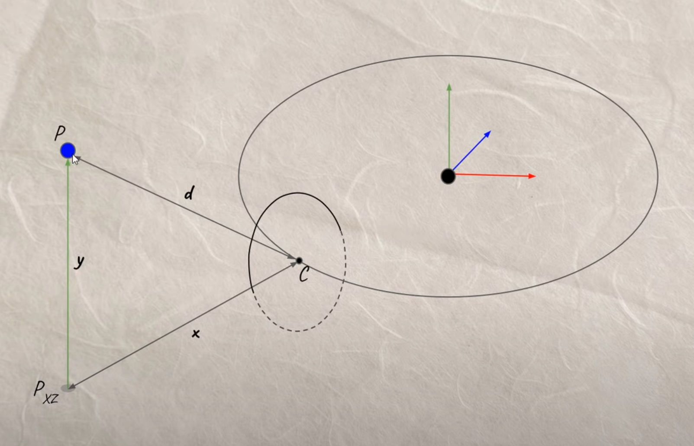
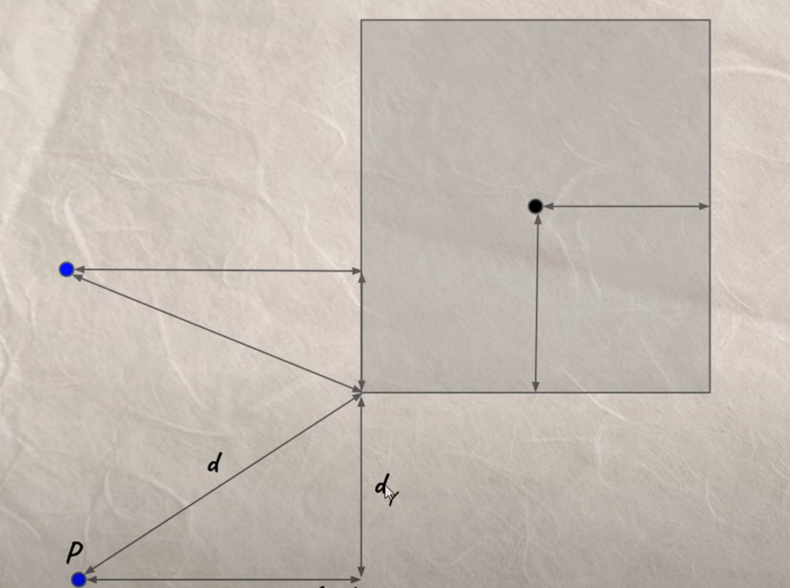
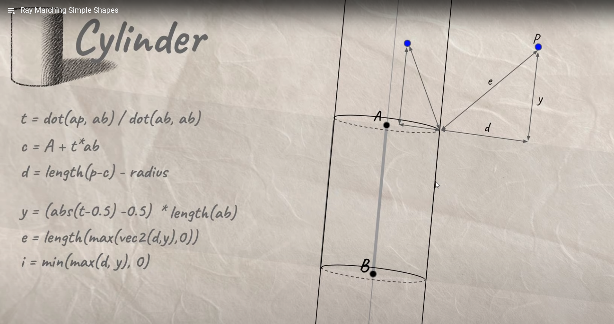

<H1> Unity Raymarching Notes</H1>
教程作者: The Art of Code (Youtube)
视频链接: https://www.youtube.com/watch?v=Ff0jJyyiVyw&list=PLGmrMu-IwbgtMxMiV3x4IrHPlPmg7FD-P

## 简单的场景

Raymarching是从光源处(摄像机)向当前片段的方向发射光线并进行步进,并在碰到物体后返回从光源处到触碰到的物体的表面的距离.

每次步进开始前,光线从当前位置计算出到物体表面的最短距离,并向当前像素方向步进该距离,然后再次计算距离,并再次步进,直到光线的位置与物体表面的最小距离小于预定的阈值,raymarching函数会返回从光源位置到该物体表面的距离.

在不计算任何光照或其他额外的信息的情况下,光线步进函数所呈现出的画面即为光源(摄像机)到场景中所有可见物体的距离(越暗越近,越白越远),如下图:

在获取到光源到场景中的距离之后,可以通过在物体表面位置的近点找三个点来计算出物体在该表面位置的法线方向,以此来计算光照.

    // 计算物体表面法线方向
    float3 GetNormal(float3 rayPos)
    {
        float distRayToObj = GetDist(rayPos);           // 获取光线当前位置到最近物体表面的距离
        float2 pointDelta = float2(0.01, 0);            // 取光线当前位置周围的点所需的偏移量
        float3 normalDir = distRayToObj - float3(       // 计算物体表面法线方向
            GetDist(rayPos - pointDelta.xyy),
            GetDist(rayPos - pointDelta.yxy),
            GetDist(rayPos - pointDelta.yyx));
        return normalize(normalDir);
    }

光照中阴影的计算相对简单,只需要使光线以触碰到物体表面的位置为原点,向光源方向进行步进,获取到从光线位置到最近触碰到的物体表面的距离,如果距离大于光线位置到光源位置的距离,则该光线位置不在阴影中;如果小于光线位置到光源位置的距离,则说明光线位置和光源位置中间有物体,则该光线位置处于阴影中.

   

## 各种多边形

### 胶囊体

把胶囊体想成一个圆头直线,由两个端点A,B确定胶囊的方向并归一化,使A和B不管距离多远AB都在0-1的区间,而AP在AB上的投影点C到P(光线当前位置)的距离减去胶囊的半径即为光线到最近的胶囊体表面的距离.

    // 胶囊体距离场
    float sdCapsule(float3 rayCurrentPos)
    {
        float3 AtoB = _CapsuleEndB - _CapsuleEndA;
        float3 AtoRay = rayCurrentPos - _CapsuleEndA;
        float t = dot(AtoB, AtoRay) / dot(AtoB, AtoB);
        t = clamp(t, 0, 1);
        float3 c = _CapsuleEndA + t *AtoB;
        return length(rayCurrentPos - c) - _CapsuleRadius;
    }

 

### 甜甜圈

先用光线当前位置减去甜甜圈圆心位置得到图中黑点到蓝点的向量,然后用该向量的XZ的长度减去甜甜圈的半径得到距离甜甜圈的实际实体的中心的距离,再将该距离和黑蓝向量的Y值合成二维向量并取length,得到的距离减去甜甜圈的厚度即可

    // 甜甜圈距离场
    float sdTorus(float3 rayCurrentPos)
    {
        float3 rayPosRelativeToTorus = rayCurrentPos - _TorusOrigin;
        float distTorusOriginToRay_XZ = length(rayPosRelativeToTorus.xz) - _TorusRadius;
        float distGroundToRay = rayPosRelativeToTorus.y;
        float distTorusToRay = length(float2(distTorusOriginToRay_XZ, distGroundToRay)) - _TorusThickness;
        return distTorusToRay;
    }

### 盒体

(没完全弄懂)

    // 盒体距离场
    float sdBox(float3 rayCurrentPos)
    {
        float3 rayPosRelativeToBox = rayCurrentPos - _BoxOrigin;
        return length(max(abs(rayPosRelativeToBox) - _BoxSize, 0));
    }

### 圆柱体

(没完全弄懂)

    // 圆柱体距离场
    float sdCylinder(float3 rayCurrentPos)
    {
        float3 AToB = _CylinderEndB - _CylinderEndA;
        float3 AToRay = rayCurrentPos - _CylinderEndA;
        float AtoRayProjOnAtoB = dot(AToRay, AToB) / dot(AToB, AToB);
        float3 c = _CylinderEndA + AtoRayProjOnAtoB * AToB;

        float x = length(rayCurrentPos - c) - _CylinderRadius;
        float y = (abs(AtoRayProjOnAtoB - 0.5) - 0.5) * length(AToB);
        float e = length(max(float2(x, y), 0.0));
        float i = min(max(x, y), 0.0);

        return e + i;
    }

## 常用运算

### 基础运算
平移: 使用当前光线位置减去物体平移后的目标位置得到的向量代替原本的光线位置进行后续的距离场计算

旋转: (简单的旋转)使用2D旋转矩阵对想要旋转的平面进行旋转

    // 盒体距离场
            float sdBox(float3 rayCurrentPos)
            {
                float3 rayPosRelativeToBox = rayCurrentPos - _BoxOrigin.xyz;    // 平移盒体
                rayPosRelativeToBox.xz = mul(Rotate(_Time.y), rayPosRelativeToBox.xz);      // 旋转盒体
                return length(max(abs(rayPosRelativeToBox) - _BoxSize.xyz, 0));
            }

缩放: 用缩放的三维向量乘以物体位置到光线位置的向量,并将得到的距离结果除以缩放向量的分量的最大值

### Blend

对两个物体的距离进行插值:

    float box = sdBox(rayCurrentPos);
                float sphere = sdSphere(rayCurrentPos, _SphereCOrigin.xyz, _SphereCRadius);
                distance = lerp(box, sphere, sin(_Time.y) * 0.5 + 0.5);

### SmoothUnion

Smooth min两个物体:

    float sphereA = sdSphere(rayCurrentPos, float3(sin(_Time.y) * 0.8 + _SphereAOrigin.x, _SphereAOrigin.y, 
                _SphereAOrigin.z), _SphereARadius);
                float sphereB = sdSphere(rayCurrentPos, float3(_SphereBOrigin.x, sin(_Time.z) * 0.5 + _SphereBOrigin.y, 
                _SphereBOrigin.z), _SphereBRadius);
                distance = smin(sphereA, sphereB, _Smoothness);

### Boolean

相减: max(-ObjectA, OjbectB)

相交: max(ObjectA, ObjectB)

